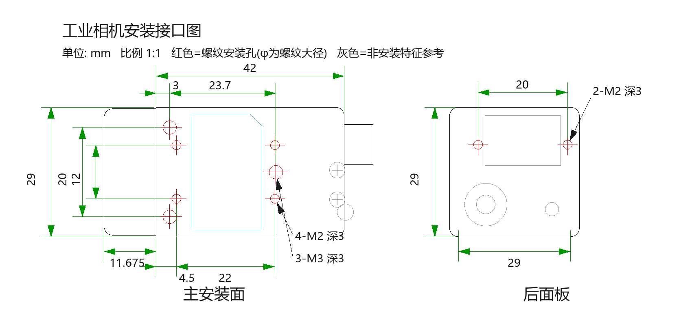

# drawing-to-dxf

把机械**尺寸图**（照片 / 截图 / 标注数据）测量成几何，一键输出两份 DXF：

| 输出 | 格式 | 用途 |
|------|------|------|
| **标注版** | ASCII DXF (R12 / GBK) | AutoCAD 看图：完整尺寸、孔注释、标题 |
| **几何版** | ASCII DXF (R2000 / 纯 ASCII) | **Fusion 360「插入 DXF」**：只含 LINE/ARC/CIRCLE |

针对 Fusion 360 报 **「无法插入此 DXF 文件」** 的场景做了专门兼容：去掉文字与填充实体、文件名 ASCII、单位 mm。



## 示例输出（examples/）

真实生成的工业相机安装接口图，可直接下载查看：

| 文件 | 说明 |
|------|------|
| `examples/preview_annotated.png` | 标注版渲染预览（上图） |
| `examples/camera_mount_annotated.dxf` | 标注版 DXF：尺寸 + 孔注释（AutoCAD 打开） |
| `examples/camera_mount_fusion.dxf` | 几何版 DXF：纯 LINE/ARC/CIRCLE（Fusion 360 插入） |

## 功能

- 从图纸位图测量特征坐标（比例尺标定、圆环拟合、长直线检测）
- 用**标注数值反推**孔位（尺寸链自洽，如 3+23.7=26.7），像素只做校验
- 标注版：自动绘制尺寸线/箭头/引出注释（窄尺寸箭头外置、文字避让）
- 几何版：优先 ezdxf 产出 R2000 完整结构，无网络时回退手工 R12
- 生成后回读校验（实体统计、`fusion_safe` 检查）+ 渲染 PNG 目视核对

## 在 MiMo Desktop 中安装（作为 Skill）

把本仓库内容复制到技能目录（**不要**把 README.md 一起拷进技能目录）：

```
~/.config/mimocode/skills/drawing-to-dxf/
├── SKILL.md
├── scripts/dxf_kit.py
├── references/image-measurement.md
└── references/format-notes.md
```

新会话即自动生效。触发语示例：「生成 DXF」「把这张图纸画成 DXF」「Fusion 360 无法插入此 DXF」。

## 目录结构

```
├── SKILL.md                     # 技能主文件（工作流 + 硬规则 + 故障表）
├── scripts/
│   └── dxf_kit.py               # 生成/校验/渲染工具库（含 CLI）
├── references/
│   ├── image-measurement.md     # 图纸照片测量方法（比例尺、环拟合、尺寸链）
│   └── format-notes.md          # DXF 版本/编码/各 CAD 软件兼容清单
├── examples/                    # 真实示例：预览图 + 两版 DXF
└── locales/                     # MiMo Desktop 插件页显示名
```

## 快速使用

### 命令行

```bash
# 校验一份 DXF（实体统计 + Fusion 兼容性）
python scripts/dxf_kit.py inspect camera_mount_interface_fusion.dxf
# → fusion_safe: True / has_text: False / ...

# 渲染预览 PNG（生成后目视核对用）
python scripts/dxf_kit.py render camera_mount_interface_fusion.dxf preview.png
```

### Python API

```python
from dxf_kit import AnnotatedDXF, write_geometry_dxf, rounded_rect_lines

# 标注版（AutoCAD）
d = AnnotatedDXF()
d.line("OUTLINE", 0, 14.5, 42, 14.5)
d.circle("HOLES", 3, 10, 1.5)                 # M3 孔按螺纹大径
d.dim_h(0, 42, 21.5, "42", (14.5, 12.5))      # 见证线起点支持圆角切点/孔边
d.leader(30.5, -14, 27, -6.9, "4-M2 深3", 31, -15.2)
d.save("annotated.dxf")                       # GBK / R12

# 几何版（Fusion 360）
lines, arcs, circles = [], [], []
rounded_rect_lines("OUTLINE", -11.675, -14.5, 42, 14.5, 2, (lines, arcs))
circles.append(("HOLES", 3, 10, 1.5))
write_geometry_dxf("camera_mount_interface_fusion.dxf", lines, arcs, circles)
```

几何版建议安装 ezdxf 以获得最完整的 R2000 结构：

```bash
pip install ezdxf --target ./pylib
```

## Fusion 360 导入步骤

1. 打开/新建设计 → **草图 → 插入 → 插入 DXF**
2. 选择 `*_fusion.dxf`（英文文件名那份）
3. 单位选 **mm**（文件已声明 `$INSUNITS=4`，仍建议手动确认）

**Fusion 兼容硬规则**（踩坑总结）：

- 只允许 LINE / ARC / CIRCLE —— TEXT、SOLID、HATCH、DIMENSION 会令整份导入失败
- 文件名必须纯 ASCII，不要用中文名
- 全文件字节 < 128（纯 ASCII）

## 约定速查

- **坐标系**：主安装面原点 = 前段/机身接缝 × 孔阵中心，y 向上
- **螺纹孔**按大径绘制（M2→Ø2，M3→Ø3），注释写「N-Mx 深y」（GBK 无 ↧ 符号，直径用 φ 不用 Ø）
- **图层**：`OUTLINE` 轮廓 / `HOLES` 安装孔（红）/ `PANEL` 凹板避让 / `REF` 非安装特征（灰）/ `DIM`+`TEXT` 仅标注版
- 尺寸标注数值是权威；照片像素与标注冲突时以标注为准，俯/侧视图交叉验算

## 开发

生成器与校验逻辑集中在 `scripts/dxf_kit.py`（无第三方依赖即可跑标注版；几何版增强需要 ezdxf，可选）。校验技能目录格式：

```bash
python /path/to/skill-creator/scripts/validate_skill.py .
```

## License

MIT
